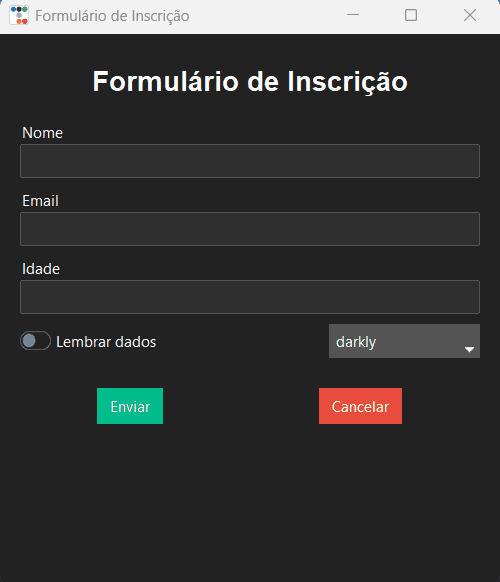

# Formulário de Inscrição (Python)

Aplicação desktop desenvolvida em **Python** utilizando **Tkinter com ttkbootstrap**, com foco em uma interface gráfica moderna e distribuição por meio de um executável para Windows.

## Preview


## Download
[Baixar versão executável](output/FormularioInscricao.exe)

## Tecnologias Utilizadas
- Python
- Tkinter
- ttbootstrap
- Pillow (PIL)

## Funcionalidades
- Interface gráfica desktop
- Campos de entrada (nome, email e idade)
- Checkbox para opções adicionais
- Troca dinâmica de temas
- Exibição dos dados preenchidos
- Ícone personalizado da aplicação

## Dependências
Instale as dependências com:

```bash
pip install -r requirements.txt
